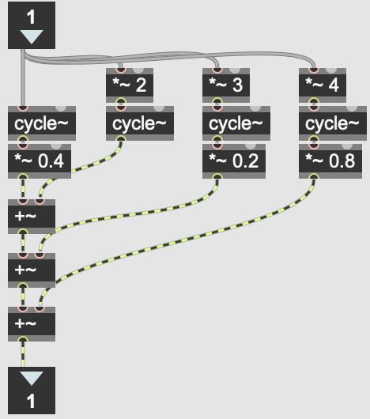
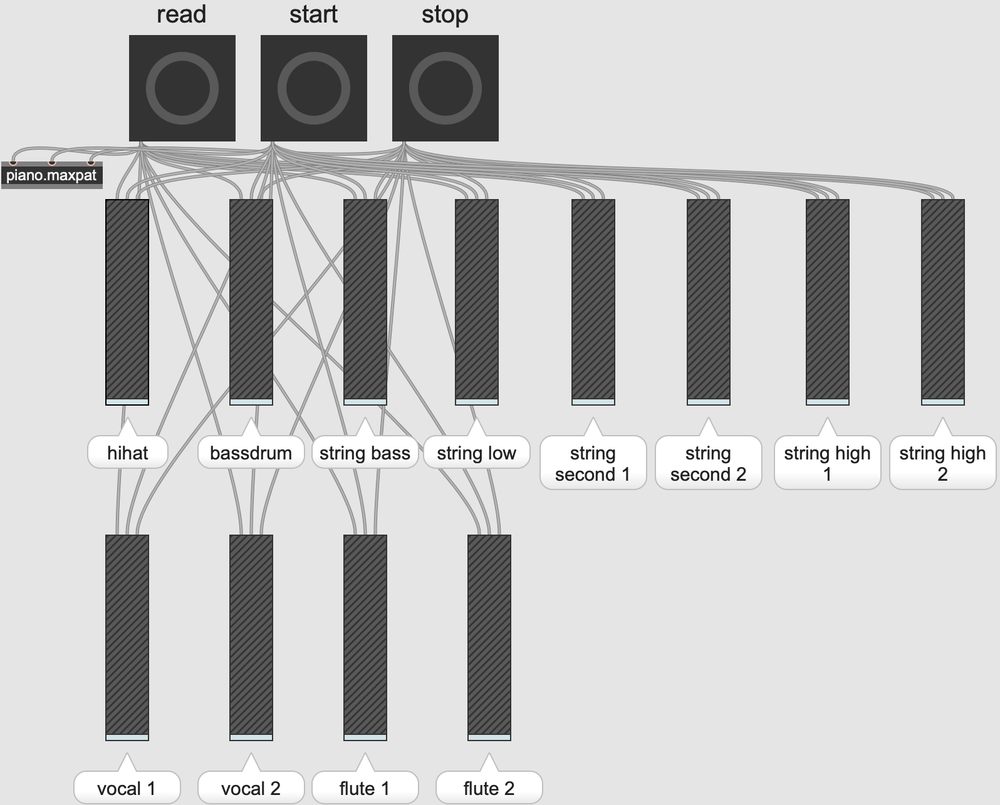
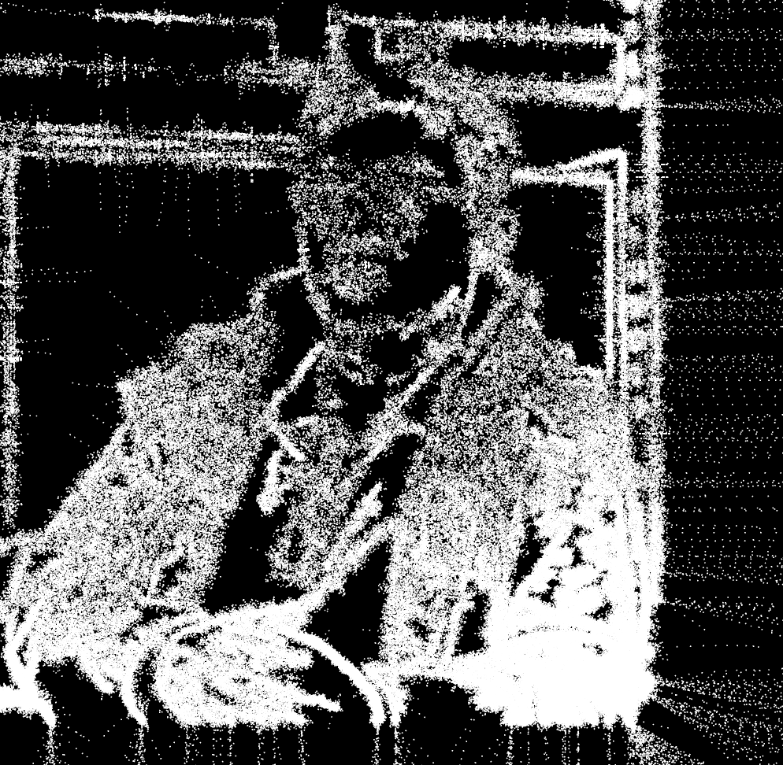

# DSAC - Final Project
## Introduction
This is the final project from Digtal Sound Art and Creation (DSAC). 
We have been tasked with designing a performance that integrates both auditory and visual elements, which will take place in the Black Box Theater at the National Taiwan Science Education Center.

Our team has decided to modify the random walker to convey the meaning of "seemingly random art is, in fact, the result of meticulous artist design." Additionally, we will reorchestrate and produce a new arrangement for "[Two Steps from Hell - Victory](https://www.youtube.com/watch?v=hKRUPYrAQoE)" to serve as the background music during the performance.

## Auditory Element
### Reorchestration
The song "Victory" has been reorchestrated by another team member into 13 tracks, incorporating instruments such as piano, flute, violin, viola, trumpet, hihat, and bass drum. 
To facilitate production using Max 8, the audio tracks were exported as MIDI files, ensuring that there are no overlapping notes within the same track.

### Production
Production using [Max 8](https://cycling74.com/downloads) is divided into two part: signal processing and timbre creation.

1. Signal Processing
	
	In the MIDI file, each note sends two signals, the first representing the start and the second representing the end. Therefore, after loading the MIDI file, I parse out the pitch and velocity (indicating the note's intensity). Utilizing an [ADSR](https://docs.cycling74.com/max8/refpages/adsr~) (Attack, Decay, Sustain, Release) object, I pass the velocity to generate appropriate intensity signals. The adjustment of ADSR parameters involves trial and error to find the most suitable combination for various timbres. As for pitch, it is a crucial factor in waveform generation.

	It's worth noting that simulating the bass drum's sound with ADSR is challenging, so I manually created a function to achieve this. 
	
2. Timbre Creation

	Creating timbres involves generating waveforms based on pitch. I employed two different methods: 
	
	The first utilizes the [simpleFM](https://docs.cycling74.com/max8/tutorials/06_synthesischapter05) object, which generates waveforms based on input frequency, harmonicity ratio, and modulation index. I experimented with various parameters to find the most suitable ones. 
	
	The second method involves examining the Fourier transform of instruments, analyzing waveform composition, and simulating it by overlaying multiple sine waves. This approach was used for the violin and flute because these timbres are challenging to simulate with simpleFM, and there is abundant Fourier transform data available online.
	There's an example for synthesizing flute timbre, where the topmost input is the frequency and the bottom output is waveform:
	

By combining the intensity signals and waveforms, and then using the [dac](https://docs.cycling74.com/max8/refpages/dac~) object, sound can be output based on the MIDI file. 

### Demo
There's a [link](https://youtu.be/ZYCsnA9kni4) to demo video.

I created a main program to control all tracks at once, achieving the goal of playing the entire composition. After cloning this repository, open `main.maxpat` with MAX 8. You will see the following interface. Press "read," then "start," and adjust the volume of each track to listen to the music.

## Visual Element

We used p5.js to implement the random walker and created a web page for it. In contrast to pure randomness, our end product will depict a portrait of the teacher.

By employing the Canny Algorithm, we performed edge detection on the teacher's photo, using it as the basis for the random walker's movement. As the random walker "walks," we guide it towards the nearest edges. This process transforms what initially appears to be a random image into a final visual representation. This approach also conveys the meaning that art is carefully designed. 

There's the result:

This part is done by [another teammate](https://github.com/syun413/p5js-randomwalker-sketch-face).
